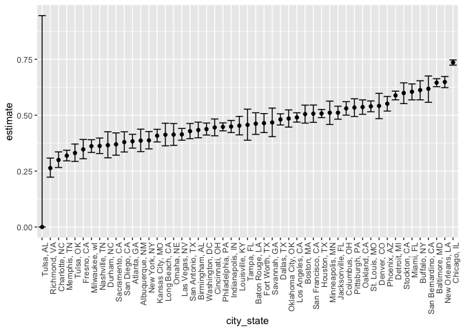
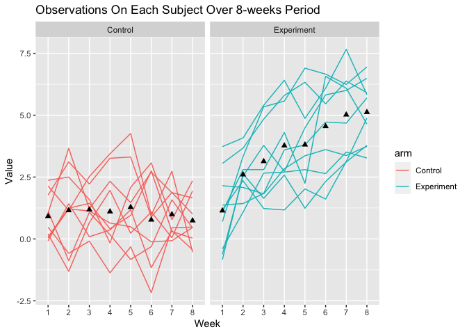
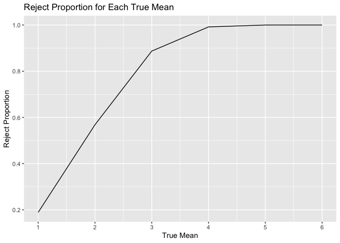
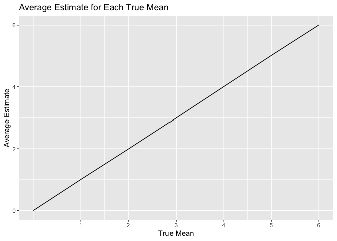

p8105_hw5_yy3439
================
2023-11-14

``` r
library(tidyverse)
```

    ## ── Attaching core tidyverse packages ──────────────────────── tidyverse 2.0.0 ──
    ## ✔ dplyr     1.1.3     ✔ readr     2.1.4
    ## ✔ forcats   1.0.0     ✔ stringr   1.5.0
    ## ✔ ggplot2   3.4.3     ✔ tibble    3.2.1
    ## ✔ lubridate 1.9.2     ✔ tidyr     1.3.0
    ## ✔ purrr     1.0.2     
    ## ── Conflicts ────────────────────────────────────────── tidyverse_conflicts() ──
    ## ✖ dplyr::filter() masks stats::filter()
    ## ✖ dplyr::lag()    masks stats::lag()
    ## ℹ Use the conflicted package (<http://conflicted.r-lib.org/>) to force all conflicts to become errors

``` r
library(ggplot2)
library(purrr)
library(broom)
```

## Problem 1

``` r
homicide_data = read_csv("./data/homicide-data.csv") #import data
```

    ## Rows: 52179 Columns: 12
    ## ── Column specification ────────────────────────────────────────────────────────
    ## Delimiter: ","
    ## chr (9): uid, victim_last, victim_first, victim_race, victim_age, victim_sex...
    ## dbl (3): reported_date, lat, lon
    ## 
    ## ℹ Use `spec()` to retrieve the full column specification for this data.
    ## ℹ Specify the column types or set `show_col_types = FALSE` to quiet this message.

### Description of the Raw Data

The raw data has 12 columns and 52179 rows. The variables(columns) are
comprised of two types: characters and numerical.

### Total Number of homicides and the number of unsolved homicides

``` r
homicide_data_tidy = homicide_data|>
  mutate(city_state = str_c(city, state, sep = ", ", collapse = NULL))|> #create the city_state variable
  mutate(result = case_when(
    disposition == "Closed without arrest" ~ "unsolved", #create the result variable which indicates whether the case is solved or unsolved
    disposition == "Closed by arrest" ~ "solved",
    disposition == "Open/No arrest" ~ "unsolved"
  ))
```

``` r
homicides_sum = homicide_data_tidy|>
  group_by(city_state)|>
  summarise(total_homicides = n(),
            unsolved_homicides = sum(result == "unsolved"))
homicides_sum
```

    ## # A tibble: 51 × 3
    ##    city_state      total_homicides unsolved_homicides
    ##    <chr>                     <int>              <int>
    ##  1 Albuquerque, NM             378                146
    ##  2 Atlanta, GA                 973                373
    ##  3 Baltimore, MD              2827               1825
    ##  4 Baton Rouge, LA             424                196
    ##  5 Birmingham, AL              800                347
    ##  6 Boston, MA                  614                310
    ##  7 Buffalo, NY                 521                319
    ##  8 Charlotte, NC               687                206
    ##  9 Chicago, IL                5535               4073
    ## 10 Cincinnati, OH              694                309
    ## # ℹ 41 more rows

As a result, the data frame contains each city in the U.S. and their
corresponding totoal number of homicides as well as total number of
unsolved homicides.

### Conduct `prop.test` on Baltimore

``` r
Baltimore_hom_total = homicides_sum|>
  filter(city_state == "Baltimore, MD")|>
  pull(total_homicides)
Baltimore_hom_unsolved = homicides_sum|>
  filter(city_state == "Baltimore, MD")|>
  pull(unsolved_homicides)

baltimore_test = prop.test(Baltimore_hom_unsolved, Baltimore_hom_total)
baltimore_test_tidy = broom::tidy(baltimore_test)
```

As a result, the estimated proportion of unsolved homicides in Baltimore
is 0.6455607. In addition, the confidence interval is \[0.6275625,
0.6631599\]. Additionally, the estimated proportion falls between the
confidence interval.

### Conduct the `prop.test` On Each City

``` r
test = homicides_sum |>
  mutate(
  prop_test = map2(homicides_sum$unsolved_homicides, homicides_sum$total_homicides, \(x, y) prop.test(x = x, n = y)),
  tidy_test = map(prop_test, broom::tidy))|>
  select(-prop_test)|>
  unnest(tidy_test)|>
  select(city_state, estimate, conf.low, conf.high)
```

    ## Warning: There was 1 warning in `mutate()`.
    ## ℹ In argument: `prop_test = map2(...)`.
    ## Caused by warning in `prop.test()`:
    ## ! Chi-squared approximation may be incorrect

``` r
test
```

    ## # A tibble: 51 × 4
    ##    city_state      estimate conf.low conf.high
    ##    <chr>              <dbl>    <dbl>     <dbl>
    ##  1 Albuquerque, NM    0.386    0.337     0.438
    ##  2 Atlanta, GA        0.383    0.353     0.415
    ##  3 Baltimore, MD      0.646    0.628     0.663
    ##  4 Baton Rouge, LA    0.462    0.414     0.511
    ##  5 Birmingham, AL     0.434    0.399     0.469
    ##  6 Boston, MA         0.505    0.465     0.545
    ##  7 Buffalo, NY        0.612    0.569     0.654
    ##  8 Charlotte, NC      0.300    0.266     0.336
    ##  9 Chicago, IL        0.736    0.724     0.747
    ## 10 Cincinnati, OH     0.445    0.408     0.483
    ## # ℹ 41 more rows

### Visualization

``` r
test|>
  mutate(city_state = fct_reorder(city_state, estimate))|>
  ggplot(aes(x = city_state, y = estimate))+
  geom_point()+
  geom_errorbar(aes(ymin = conf.low, ymax = conf.high))+
  theme(axis.text.x = element_text(angle = 90, hjust = 1))
```

<!-- -->

## Problem 2

### Step 1

Ceate a dataframe containing all file names.

``` r
filenames_data = list.files(path = "data_p2/") #import data
```

### Step 2

Then, we iterate file names and read in data for each subject using
`purrr::map` and saving the result as a new variable in the dataframe.
Additionally, we add each participant’s id as the first entry column.

``` r
files_df = map_dfr(filenames_data, ~read_csv(file.path("data_p2/", .)), .id = "id")|>
  mutate(id = as.numeric(id))|>
  bind_rows()
```

### Step 3

Finally, we should tidy the `files_df` data frame and include the
control arm and subject ID.

``` r
files_df_tidy = files_df|>
  mutate(arm = case_when(
    id < 11 ~ "Control",
    id >10 ~ "Experiment"
  ),
  subject_id = ifelse(
    id < 11, id, id-10
  )) |>
  pivot_longer(
    cols = starts_with("week"),
    names_to = "week",
    values_to = "values",
    names_prefix = "week_"
  )|>
  select(-id)|>
  relocate(subject_id, arm)|>
  mutate(subject_id = as.character(subject_id))
```

The above data frame containing subject id for both control and
experiment groups as well as each week’s values for every participants.
It has 160 rows and 4 columns.

### Visualization

Then, we would create a spaghetti plot showing observations on each
subject over time.

``` r
spaghetti_p = ggplot(files_df_tidy, aes(x = week, y = values, group = subject_id))
spaghetti_p+
  geom_line(aes(color = arm))+
  stat_summary(aes(group = 1), geom = "point", fun.y = mean,
    shape = 17, size = 2)+
  facet_grid(~arm)+
  labs(title = "Observations On Each Subject Over 8-weeks Period")+
  xlab("Week")+
  ylab("Value")
```

    ## Warning: The `fun.y` argument of `stat_summary()` is deprecated as of ggplot2 3.3.0.
    ## ℹ Please use the `fun` argument instead.
    ## This warning is displayed once every 8 hours.
    ## Call `lifecycle::last_lifecycle_warnings()` to see where this warning was
    ## generated.

<!-- -->
Based on the above graph, we can see that the mean values(indicated by
the black triangle points) of the control group is generally more stable
and are less than their corresponding experiment groups for each week.
Conversely, the mean value of the experiment group increases almost
every week from week 1 to week 8.

## Problem 3

First, set the seed so that our results would be reproducible.

``` r
set.seed(1) #so that the results are reproducible 
```

Then, we generate 5000 datasets from the model.

``` r
output = vector("list", 5000)

for (i in 1: 5000){
  dataset = rnorm(n = 30, mean = 0, sd = 5)
  output[[i]] = dataset
}
```

Next, for each dataset, save mu_hat and the p-value.

``` r
t_test = function(data){
  t.test(data, conf.level = 0.95)|>
    broom::tidy()|>
    select(estimate, p.value)
}

#when the true mean is 0
t_test0 = map(output, t_test)|>
  bind_rows()
```

Then, we can use simulation to repeat the above process for true mean =
{1,2,3,4,5,6}.

``` r
simulation = function(true_mean){
  sim_data = tibble(
    x = rnorm(n = 30, mean = true_mean, sd = 5)
  )
  
  output = sim_data|>
    t.test()|>
    broom::tidy()|>
    select(estimate, p.value)
}

sim_results_df = 
  expand_grid(
    true_mean = c(0,1,2,3,4,5,6),
    iter = 1:5000
  ) |> 
  mutate(
    estimate = map(true_mean, simulation)
  ) |> 
  unnest(estimate)
```

### Visualization: Part 1

``` r
sim_results_df|>
  group_by(true_mean)|>
  summarise(
    reject = sum(p.value < 0.05),
    reject_prop = reject/5000
  )|>
  ggplot(aes(x = true_mean, y = reject_prop))+
  geom_line()+
  scale_x_continuous(breaks = c(1:6))+
  labs(title = "Reject Proportion for Each True Mean")+
  xlab("True Mean")+
  ylab("Reject Proportion")
```

<!-- -->

Based on the above graph, we can see that, as the true mean increases,
the proportion of rejected null hypothesis increases. This association
can be interpreted as larger effect size would increase the power of the
study.

### Visualization: Part 2

``` r
sim_results_df|>
  group_by(true_mean)|>
  summarise(avg_estimate = mean(estimate))|>
  ggplot(aes(x= true_mean, y = avg_estimate))+
  geom_line()+
  scale_x_continuous(breaks = c(1:6))+
  labs(title = "Average Estimate for Each True Mean")+
  xlab("True Mean")+
  ylab("Average Estimate")
```

<!-- -->

### Visualization: Part 3

``` r
sim_results_df|>
  filter(p.value < 0.05)|>
  group_by(true_mean)|>
  summarise(avg_estimate_rej = mean(estimate))|>
  ggplot(aes(x= true_mean, y = avg_estimate_rej))+
  geom_line()+
  scale_x_continuous(breaks = c(1:6))+
  labs(title = "Average Estimate of Rejected for Each True Mean")+
  xlab("True Mean")+
  ylab("Average Estimate of Rejected")
```

<!-- -->
